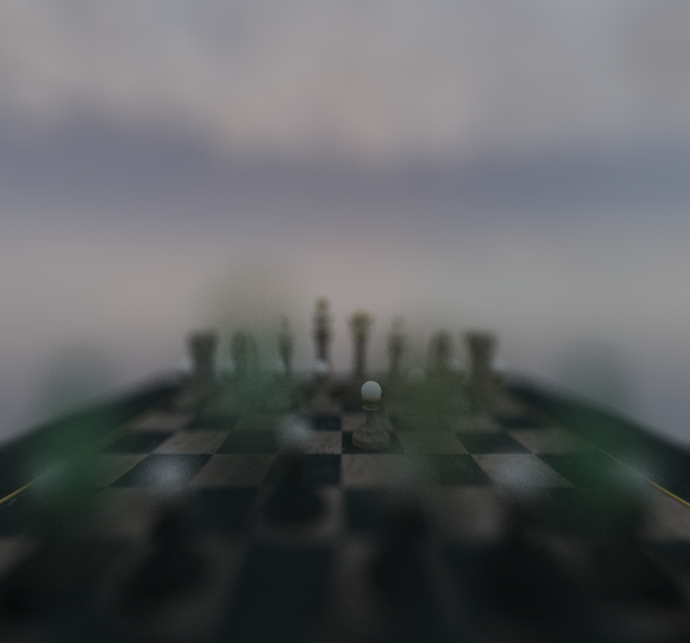

CUDA Path Tracer
================

**University of Pennsylvania, CIS 565: GPU Programming and Architecture, Project 3**

* Lijun Qu
  * [LinkedIn](https://www.linkedin.com/in/lijun-qu-398375251/), [personal website](www.lijunqu.com).
* Tested on: Windows 11, i7-14700HX (2.10 GHz) 32GB, Nvidia GeForce RTX 4060 Laptop

* [Intro](#Introduction)
* [Features](#Features)
  * [BSDFs](#BSDFs)
  * [Physically-based Depth-of-field](#Physically-based-Depth-of-field)
  * [Integrators](#Integrators)
  * [Mesh and Texture Loading](#Mesh-Loading)
  * [Denoiser](#OIDN)
* [Perf Analysis](#Perf-Analysis)
* [Extras and Bloopers](#Extras-and-Bloopers)
* [Credits](#Credits)
-----

##### Example Renders:

  

###### [Source](https://sketchfab.com/3d-models/matilda-7ddedfb652bd4ea091bc3de27f98fc02)

  

###### [Source](https://sketchfab.com/3d-models/cathedral-faed84a829114e378be255414a7826ca)

  
  

###### [Source](https://sketchfab.com/3d-models/shaw-hornet-hollow-knight-silksong-670a87a9234c40bc9c2a4f274f6d8cc1)

  

## Introduction

I built a CUDA path tracer into a feature-complete, toggleable renderer. Core work includes 
* BSDF shading (diffuse, perfect specular), 
* stochastic AA, 
* stream-compacted path termination, 
* material-based sorting. 

I added 
* physically-based refraction, 
* depth of field, 
* HDRI environment lighting, 
* PBR texture mapping on glTF meshes (albedo/normal/metal-rough). 

For performance, I implemented 
* Russian Roulette 
* a CPU-built BVH with iterative GPU traversal, 
* integrated Intel Open Image Denoiser for cleaner images at low spp. 

I profiled with Nsight and reported rays-per-bounce and per-kernel stacked bars, showing compaction/RR benefits (especially in closed scenes), reduced intersection time with BVH on heavy meshes, and clear quality gains from DoF, refraction, and denoising.

## Features

### BSDFs

* #### Diffuse

  

* #### Specular

  
  |  |  |
  |:--:|:--:|
  

* #### Refraction

  
  |  |  |  |  |
  |:--:|:--:|:--:|:--:|
  

I implemented specular transmission for dielectrics (glass/water) as a delta BSDF. At a surface hit, I first detect whether the ray is entering or exiting using cosThetaI = dot(-wi, n). Based on the sign, I flip the shading normal if needed and set the index-of-refraction pair (ηi, ηt) accordingly. I then try to compute the transmitted direction with Snell’s law (glm::refract(wi, n, ηi/ηt)). If refraction is impossible (total internal reflection), I fall back to perfect mirror reflection.

For energy split, I evaluate the Fresnel term (Schlick) to get the reflectance F. I stochastically choose between reflection and transmission (probability F vs. 1−F), treating the chosen lobe as a delta event (pdf = 1). When transmitting, I scale the path throughput by (1−F) * transmissionColor * (ηt/ηi)^2 (solid-angle change), and when reflecting by F * specularColor. The new ray origin is offset by an epsilon along the chosen direction to avoid self-intersections, and the path continues with one fewer bounce. (Rough/ microfacet transmission is not used—this is perfect, smooth glass.)

Reference: [PBRv4 9.3](https://pbr-book.org/4ed/Reflection_Models/Specular_Reflection_and_Transmission)

### Physically-based Depth-of-field

  
  |  |  |  |  |  |
  |:--:|:--:|:--:|:--:|:--:|
  | *No DOF* | *Lens Radius: 0.15, Focal Dist: 10.0* | *Lens Radius: 0.8, Focal Dist: 12.0* | *Lens Radius: 0.3, Focal Dist: 12.0* |
  

I use a thin-lens camera with two parameters: lensRadius (aperture) and focalDist. For each pixel sample, I first form the usual pinhole ray to a jittered sensor sample. I then compute the focal point by intersecting that ray with a plane at focalDist along the camera forward axis. Next, I sample a point on the circular lens using concentric-disk sampling:
lensPos = eye + lensRadius * (x * camRight + y * camUp).
The final primary ray is origin = lensPos, direction = normalize(focalPoint - origin). Throughput is unchanged (camera sampling only); total blur increases with lensRadius, and setting lensRadius = 0 reduces to a pinhole camera. I offset the origin by a small epsilon along the direction to avoid self-intersection. (A circular aperture is assumed; no polygonal bokeh yet.)

Reference: [PBRv4 5.2](https://pbr-book.org/4ed/Cameras_and_Film/Projective_Camera_Models#TheThinLensModelandDepthofField)