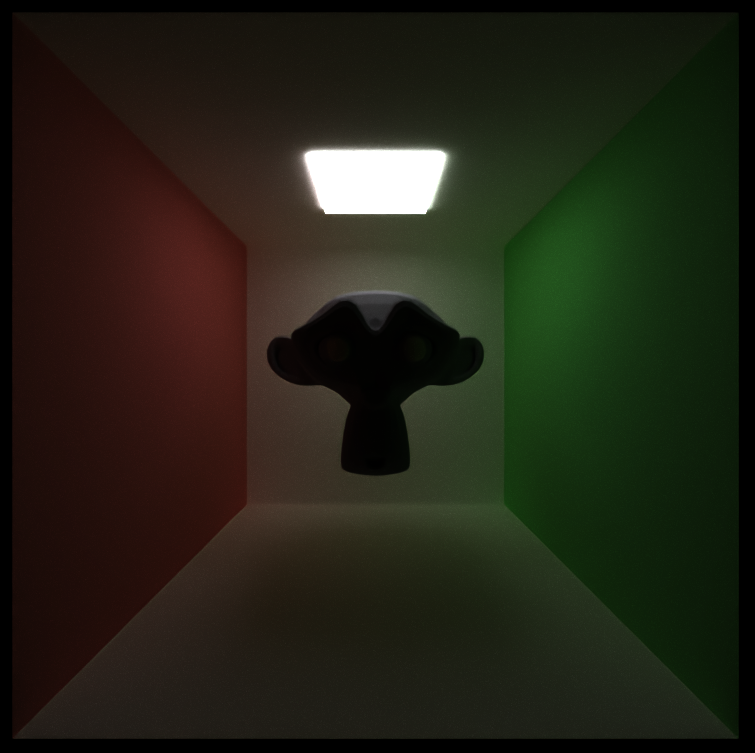

CUDA Path Tracer
================

**University of Pennsylvania, CIS 565: GPU Programming and Architecture, Project 3**

* Lijun Qu
  * [LinkedIn](https://www.linkedin.com/in/lijun-qu-398375251/), [personal website](www.lijunqu.com).
* Tested on: Windows 11, i7-14700HX (2.10 GHz) 32GB, Nvidia GeForce RTX 4060 Laptop

* [Intro](#Introduction)
* [Features](#Features)
  * [BSDFs](#BSDFs)
  * [Physically-based Depth-of-field](#Physically-based-Depth-of-field)
  * [Texture and Normal Mapping + Metallic Mapping](#Texture-and-Normal-Mapping-+-Metallic-Mapping)
  * [Mesh and Texture Loading](#Mesh-Loading)
  * [Denoiser](#OIDN)
* [Performance Analysis](#Performance-Analysis)
  * [Russian Roulette Path Termination](#Russian-Roulette-Path-Termination)
  * [BVH](#BVH)
* [Extras and Bloopers](#Extras-and-Bloopers)
-----

##### Example Renders:

  

###### [Source](https://sketchfab.com/3d-models/matilda-7ddedfb652bd4ea091bc3de27f98fc02)

  

###### [Source](https://sketchfab.com/3d-models/cathedral-faed84a829114e378be255414a7826ca)

  
  

###### [Source](https://sketchfab.com/3d-models/shaw-hornet-hollow-knight-silksong-670a87a9234c40bc9c2a4f274f6d8cc1)

  

-----

## Introduction

I built a CUDA path tracer into a feature-complete, toggleable renderer. Core work includes 
* BSDF shading (diffuse, perfect specular), 
* stochastic AA, 
* stream-compacted path termination, 
* material-based sorting. 

I added 
* physically-based refraction, 
* depth of field, 
* HDRI environment lighting, 
* PBR texture mapping on glTF meshes (albedo/normal/metal-rough). 

For performance, I implemented 
* Russian Roulette 
* a CPU-built BVH with iterative GPU traversal, 
* integrated Intel Open Image Denoiser for cleaner images at low spp. 

I profiled with Nsight and reported rays-per-bounce and per-kernel stacked bars, showing compaction/RR benefits (especially in closed scenes), reduced intersection time with BVH on heavy meshes, and clear quality gains from DoF, refraction, and denoising.

-----

## Features

---

### BSDFs

* #### Diffuse

  

* #### Specular

  
  |  |  |
  |:--:|:--:|
  

* #### Refraction

  
  |  |  |  |  |
  |:--:|:--:|:--:|:--:|
  

I implemented specular transmission for dielectrics (glass/water) as a delta BSDF. At a surface hit, I first detect whether the ray is entering or exiting using cosThetaI = dot(-wi, n). Based on the sign, I flip the shading normal if needed and set the index-of-refraction pair (ηi, ηt) accordingly. I then try to compute the transmitted direction with Snell’s law (glm::refract(wi, n, ηi/ηt)). If refraction is impossible (total internal reflection), I fall back to perfect mirror reflection.

For energy split, I evaluate the Fresnel term (Schlick) to get the reflectance F. I stochastically choose between reflection and transmission (probability F vs. 1−F), treating the chosen lobe as a delta event (pdf = 1). When transmitting, I scale the path throughput by (1−F) * transmissionColor * (ηt/ηi)^2 (solid-angle change), and when reflecting by F * specularColor. The new ray origin is offset by an epsilon along the chosen direction to avoid self-intersections, and the path continues with one fewer bounce. (Rough/ microfacet transmission is not used—this is perfect, smooth glass.)

Reference: [PBRv4 9.3](https://pbr-book.org/4ed/Reflection_Models/Specular_Reflection_and_Transmission)

---

### Physically-based Depth-of-field

  
  |  |  | |  | 
  |:--:|:--:|:--:|:--:|
  | *No DOF* | *Lens Radius: 0.15, Focal Dist: 10.0* | *Lens Radius: 0.3, Focal Dist: 12.0* | *Lens Radius: 0.8, Focal Dist: 12.0* |
  

I use a thin-lens camera with two parameters: lensRadius (aperture) and focalDist. For each pixel sample, I first form the usual pinhole ray to a jittered sensor sample. I then compute the focal point by intersecting that ray with a plane at focalDist along the camera forward axis. Next, I sample a point on the circular lens using concentric-disk sampling:
lensPos = eye + lensRadius * (x * camRight + y * camUp).

The final primary ray is origin = lensPos, direction = normalize(focalPoint - origin). Throughput is unchanged (camera sampling only); total blur increases with lensRadius, and setting lensRadius = 0 reduces to a pinhole camera. I offset the origin by a small epsilon along the direction to avoid self-intersection. (A circular aperture is assumed; no polygonal bokeh yet.)

Reference: [PBRv4 5.2](https://pbr-book.org/4ed/Cameras_and_Film/Projective_Camera_Models#TheThinLensModelandDepthofField)

---

### Mesh Loading

This path tracer supports .glTF 3D scene loading and rendering. This was done through wrapping the [tinyGLTF library](https://github.com/syoyo/tinygltf). Here are the supported capabilities:
* Triangular Mesh Loading
* Material Loading
* Albedo Texture Loading and Sampling
* Pbject Space Normal Map Loading and Sampling

There are a few restrictions however:
* The mesh must be triangulated. Only triangles are supported currently.
* Materials must be mapped manually in your Path Tracer .json file. That is, if your glTF file has 4 unique materials, then you must define 4 materials in your .json file accordingly to allow for the 4 materials to appear in the render.

---

### Texture and Normal Mapping + Metallic Mapping

  
  |  |  |  |
  |:--:|:--:|:--:|
  | *Loaded all mappings* | *Only loaded base color* | *Only loaded normal* |
  

I use glTF 2.0 (tinygltf) for textured meshes (OBJ loads geometry only). At a triangle hit, I barycentrically interpolate UVs and sample bound textures on the GPU (bilinear, repeat/clamp per material).

Base Color (Albedo): Sample baseColorTexture (sRGB → linear). Multiply by baseColorFactor. This becomes the diffuse albedo used by my BSDF and is also written to the denoiser’s albedo AOV.

Normal Mapping: If tangents are provided in glTF, I use them; otherwise I build a per-triangle TBN from position/UV derivatives. I decode the normal map from [0,1]→[-1,1], apply optional normalScale, transform from tangent space → world, and renormalize. The resulting world normal feeds shading and the normal AOV for OIDN.

Metallic-Roughness: I sample the metallicRoughnessTexture and factors; roughness from the G channel, metallic from the B channel (clamped [0,1]). I compute F0 = mix(0.04, baseColor, metallic) and use metallic/roughness to modulate my specular vs diffuse energy split (smooth conductor/insulator behavior). (No full microfacet BRDF yet—roughness currently influences lobe weighting; perfect specular/diffuse are used for scattering.)

Reference: [PBRv4 10.4](https://pbr-book.org/4ed/Textures_and_Materials/Image_Texture)

---

### Mesh Loading

This path tracer supports glTF 2.0 scene loading via a lightweight wrapper around tinygltf. It handles real-world, multi-node glTF files where a single asset can contain multiple meshes/primitives, per-node transforms, and distinct texture sets.

Supported capabilities

* Triangular mesh loading: positions, indices, normals, UVs (triangulated primitives).
* Scene graph & transforms: applies each node’s TRS (with hierarchy) so one glTF can instance the same mesh with different transforms.
* Material binding: preserves per-primitive material indices; you map these to your renderer’s materials in the scene JSON.
* Texture maps (PBR Metallic-Roughness) for glTF:
    Base Color (Albedo): sampled in sRGB → linear, multiplied by baseColorFactor.
    Normal Map (tangent-space): uses glTF tangents when available; otherwise builds a per-triangle TBN from geometry/UVs.
    Metallic-Roughness: reads Roughness = G, Metallic = B and their factors; drives dielectric/metal behavior and lobe weighting.
* Samplers & wrap modes: respects glTF sampler repeat/clamp and texCoord set 0 (UV scale/offset when provided).

What this enables
* You can import complex glTFs that include many parts (chairs, floors, props, etc.), each with its own transform and texture set—all in one file.
* Multiple nodes referencing the same mesh are instanced with different transforms.
* Works seamlessly with my BVH (CPU build, iterative GPU traversal) for large triangle counts.

Restrictions / current limits
* Primitives must be triangles (glTF triangles are supported; quads/lines are not).
* OBJ is geometry-only in my renderer (no texture mapping for OBJ).
* In the scene JSON, you still define materials that correspond to the glTF material slots (e.g., if the glTF has 4 materials, define 4 entries and map indices → names).
* Single UV set (TEXCOORD_0) assumed. Occlusion/emissive maps are not wired yet.
* Normal maps are tangent-space (object-space normals are not supported).

---

### OIDN

  |  |  |
  |:--:|:--:|
  | *No OIDN applied* | *OIDN applied* |
  

I integrated Intel Open Image Denoise (OIDN) as a post-process on my path-traced output. OIDN is an open-source, CPU-based filter designed specifically for Monte Carlo noise.

Reference: [Intel OIDN](https://www.openimagedenoise.org/)

-----

## Performance Analysis

---

### Russian Roulette Path Termination

  |  |  |
  |:--:|:--:|
  | *No RR applied* | *RR applied* |

Russian Roulette (RR) probabilistically stops low-contribution paths to save work while keeping the estimator unbiased. When a path survives, its throughput is scaled by 1/p (the survival probability) so the expected contribution remains the same.

Reference: [PBRv3 13.7](https://pbr-book.org/3ed-2018/Monte_Carlo_Integration/Russian_Roulette_and_Splitting)

  

Why RR improves FPS. By probabilistically terminating low-contribution paths after a few bounces, RR reduces the average path length—fewer intersections, fewer shading evals, and less memory traffic per frame. It also removes “straggler” rays, improving warp coherence and making stream compaction more effective. The speedup is largest in closed scenes (many long, dim bounces) and smaller—but still positive—in open scenes.

